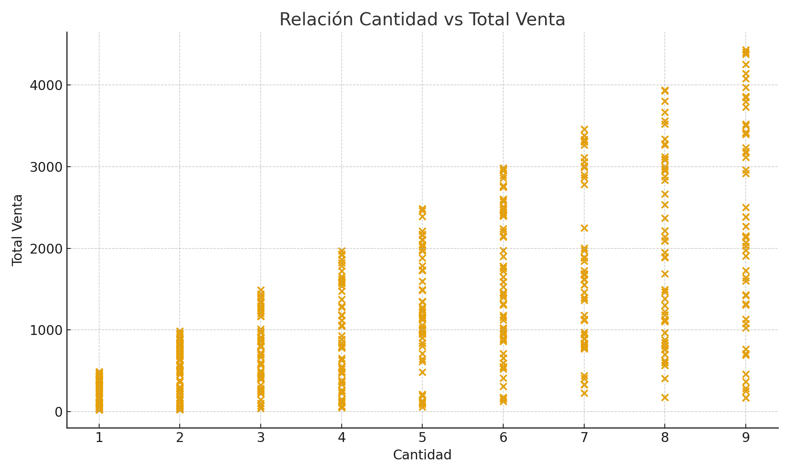
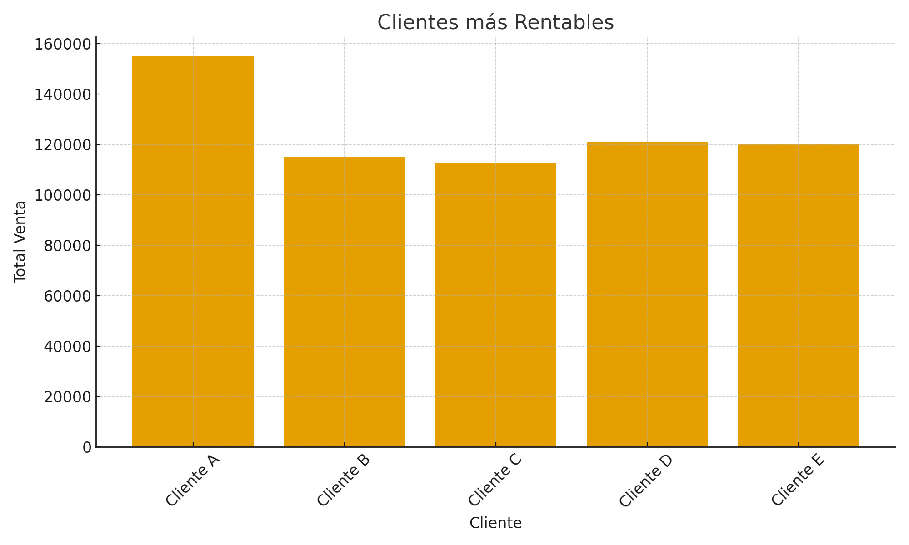
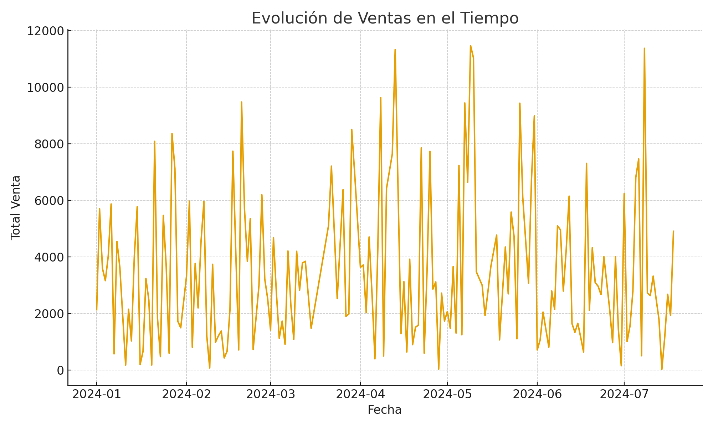

# Informe del Proyecto – Tablero de Visualización de Datos

**Autor:** Paula Andrea Terrios Ossa  
**Materia:** Ciencia de Datos  
**Fecha:** 8/11/2025  
**Tema:** Construcción de un Tablero de Ventas en Python utilizando Dash y Visualización de Datos

---

## Introducción

El análisis de datos es una herramienta clave en la toma de decisiones estratégicas dentro de las organizaciones. A través de la visualización de datos, es posible interpretar grandes volúmenes de información de forma clara, rápida y efectiva.  
En este proyecto se desarrolló un **tablero interactivo de ventas** utilizando **Python y la librería Dash**, con el objetivo de visualizar el comportamiento comercial desde diferentes perspectivas, como producto, cliente, región y temporalidad.

El tablero permite identificar tendencias, reconocer productos con mayor rotación, clientes de alto valor, y comportamientos de compra diferenciados por zonas geográficas. De esta manera, se convierte en un recurso fundamental para la **planeación comercial**, la **gestión de inventarios** y la **toma de decisiones basadas en datos**.

---

## Dataset

El dataset utilizado representa un registro de ventas, con información de:

- Fecha de la venta  
- Producto vendido  
- Cliente asociado  
- Región geográfica  
- Cantidad y precio unitario  
- Total de la venta  

Este conjunto de datos permite analizar el comportamiento de ventas desde **dimensiones comercial, temporal y geográfica**, facilitando una comprensión completa del funcionamiento del negocio.

---

## Métricas Definidas

| **Métrica** | **Justificación** |
|------------|------------------|
| Ventas Totales | Permite identificar el nivel general de ingresos generados. |
| Ventas por Producto | Ayuda a detectar cuáles productos tienen mayor rotación y rentabilidad. |
| Ventas por Cliente | Permite identificar clientes clave y oportunidades de fidelización. |
| Evolución Temporal de Ventas | Muestra tendencias, picos y estacionalidades del negocio. |
| Relación Cantidad vs Total Venta por Región | Evidencia patrones de comportamiento comercial dependiendo de la zona. |

---

## Visualizaciones y Diseño del Tablero

| **Visualización** | **Propósito** | **Tipo** |
|------------------|--------------|---------|
| Gráfico de barras - Ventas por Producto | Comparar desempeño entre productos | Comparativo |
| Línea temporal - Ventas por Fecha | Detectar tendencias y fluctuaciones | Serie temporal |
| Barras - Clientes más Rentables | Identificar clientes de mayor valor | Ranking |
| Dispersión - Cantidad vs Total Venta | Entender comportamiento de compra | Relacional |

El tablero fue diseñado para mantener **claridad visual**, organizando los elementos desde lo **general (KPI)** hacia lo **específico (gráficos analíticos y comparativos)**, facilitando la interpretación progresiva de la información.

---

## Capturas del Tablero

> A continuación se deben insertar las imágenes capturadas del dashboard:

### 1. Ventas por Producto

### 2. Evolución de Ventas en el Tiempo

### 3. Clientes Más Rentables

### 4. Relación Cantidad vs Total de Venta por Región

---

## Conclusiones

1. El tablero permite transformar datos en información estratégica, facilitando la toma de decisiones basada en evidencia visual y cuantitativa.
2. La utilidad del tablero depende directamente de la calidad y actualización constante de los datos; una adecuada gestión de la información es indispensable para obtener resultados confiables.

---

## Bibliografía

- Few, S. (2013). *Information Dashboard Design: Displaying Data for At-a-Glance Monitoring*. Analytics Press.  
- Knaflic, C. N. (2015). *Storytelling with Data: A Data Visualization Guide for Business Professionals*. Wiley.  
- McKinney, W. (2018). *Python for Data Analysis*. O'Reilly Media.

---
